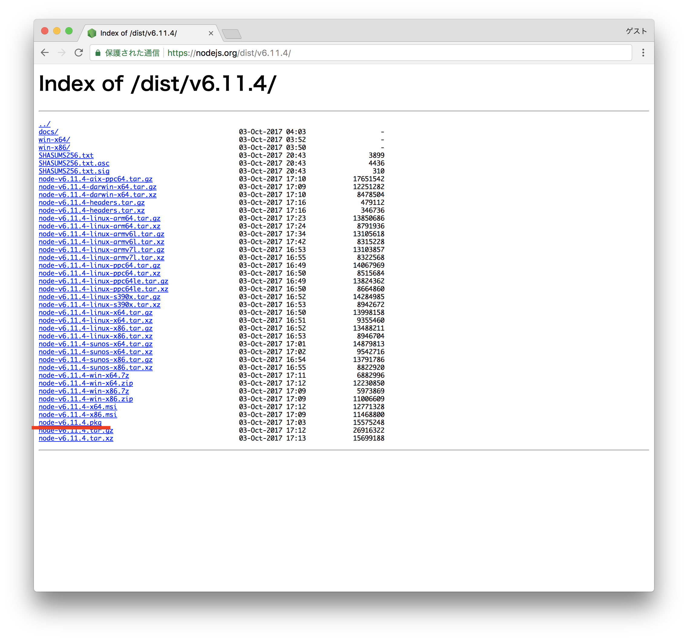

/* :vim set nofoldable: */

# 事前準備

- Node.jsのインストール
- create-react-appのインストール

## Node.jsのインストール

Node.jsのv6系（このドキュメントを記述していた時の最新は6.11.4）のインストールをお願いします。

### Macの場合

- Homebrewでインストールする
- インストーラーを使ってインストールする

#### Homebrewでインストールする

下記コマンドをコンソール上（Terminal.appやiTerm2）で実行してください。

```console
$ brew install node@6
```

`node -v`、`npm -v`を実行し、バージョンが表示されれば正常にインストールされています。

```console
$ node -v
v6.11.4

$ npm -v
3.10.10
```

ついでに、npmのバージョンを最新にしておきましょう。

```console
$ npm install -g npm
...

$ npm -v
5.4.2
```

#### インストーラーを使ってインストールする

Node.jsのサイトにアクセスします。

https://nodejs.org/ja/

左側の「6.XX.X LTS 推奨版」と書いている緑色のボタン（リンク）を押します。「node-v6.XX.X.pkg」（XX.Xの部分にはバージョン番号が入ります）のダウンロードが開始しされるはずです。


もし、下記のファイル一覧ページに遷移した場合は、「node-v6.XX.X.pkg」のリンクをクリックしてください。



「node-v6.XX.X.pkg」を開くとインストーラーが起動しますので、あとはインストーラーの表示したがって進めればインストール完了です。


下記コマンドをコンソール上（Terminal.appやiTerm2）で実行し、バージョンが表示されれば正常にインストールが完了しています。

```console
$ node -v
v6.11.4

$ npm -v
3.10.10
```

ついでに、npmのバージョンを最新にしておきましょう。

```console
$ npm install -g npm
...

$ npm -v
5.4.2
```

### Windowsの場合

## create-react-appのインストール

```console
$ npm install -g create-react-app
```
